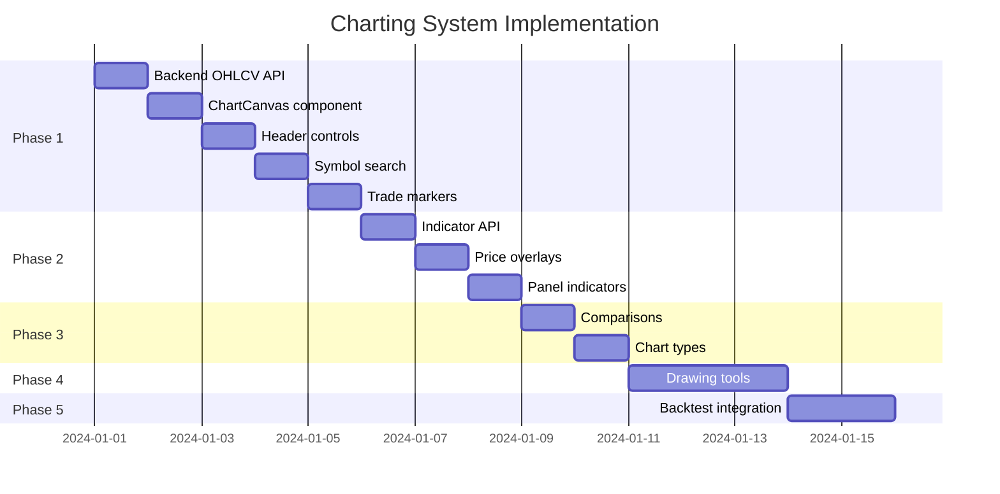

# Advanced Charting System - Technical Design

## Executive Summary

Build a professional-grade charting system inspired by Robinhood Legend/TradingView, integrated seamlessly with Bonito's backtesting engine.

## Tech Lead Council Sign-off

| Discipline | Lead | Approval |
|------------|------|----------|
| Frontend | ✓ | Lightweight Charts + React wrapper |
| Backend | ✓ | OHLCV endpoint, indicator computation API |
| Full Stack | ✓ | Real-time data flow, state sync |
| SRE | ✓ | Performance budgets, lazy loading |

---

## Architecture Overview

```
┌─────────────────────────────────────────────────────────────────┐
│                         React App                                │
├─────────────────────────────────────────────────────────────────┤
│  ┌─────────────┐  ┌─────────────┐  ┌─────────────────────────┐ │
│  │ ChartHeader │  │ ChartCanvas │  │ ChartSidebar            │ │
│  │ - Symbol    │  │ - LW Charts │  │ - Indicators (add/edit) │ │
│  │ - Interval  │  │ - Overlays  │  │ - Comparisons           │ │
│  │ - Range     │  │ - Drawings  │  │ - Chart Settings        │ │
│  │ - Search    │  │ - Markers   │  │ - Drawing Tools         │ │
│  └─────────────┘  └─────────────┘  └─────────────────────────┘ │
├─────────────────────────────────────────────────────────────────┤
│                      ChartStateManager                          │
│  - Symbol/interval state                                        │
│  - Indicator configs                                            │
│  - Drawing objects                                              │
│  - Backtest trade markers                                       │
└─────────────────────────────────────────────────────────────────┘
                              │
                              ▼
┌─────────────────────────────────────────────────────────────────┐
│                         Backend API                              │
├─────────────────────────────────────────────────────────────────┤
│  GET /api/chart/ohlcv?symbol=SPY&interval=1d&range=1Y           │
│  GET /api/chart/indicators?symbol=SPY&indicators=[...]          │
│  GET /api/chart/search?q=app                                    │
│  GET /api/backtest/{id}/trades  (for markers)                   │
└─────────────────────────────────────────────────────────────────┘
```

---

## Phase 1: Core Chart (MVP) - 3 days

### Features
- [x] Lightweight Charts integration
- [x] Candlestick chart with volume
- [x] Time range selection (1D, 1W, 1M, 3M, YTD, 1Y, All)
- [x] Interval selection (1m, 5m, 15m, 1h, 4h, 1d)
- [x] Symbol search with autocomplete
- [x] Trade markers from backtest results
- [x] Responsive resizing

### Components
```
web/src/components/chart/
├── AdvancedChart.tsx       # Main container
├── ChartCanvas.tsx         # Lightweight Charts wrapper
├── ChartHeader.tsx         # Symbol, interval, range controls
├── SymbolSearch.tsx        # Autocomplete search
├── TimeRangeSelector.tsx   # Range buttons
├── IntervalSelector.tsx    # Interval dropdown
└── TradeMarkers.tsx        # Entry/exit visualization
```

### Backend Endpoints
```python
# New routes in src/bonito/api/routes/chart.py
GET /api/chart/ohlcv
GET /api/chart/search
GET /api/chart/symbols
```

---

## Phase 2: Indicators - 3 days

### Features
- [ ] Indicator overlay system
- [ ] Price overlays: SMA, EMA, Bollinger Bands
- [ ] Separate panels: RSI, MACD, Volume histogram
- [ ] Add/remove indicators via sidebar
- [ ] Indicator settings (period, colors)

### Indicator Mapping
```typescript
// Map pandas-ta indicators to chart overlays
const PRICE_OVERLAYS = ['sma', 'ema', 'bbands', 'kc', 'donchian'];
const PANEL_INDICATORS = ['rsi', 'macd', 'stoch', 'adx', 'atr', 'obv'];
```

### Components
```
├── indicators/
│   ├── IndicatorPanel.tsx      # Separate chart panel
│   ├── IndicatorOverlay.tsx    # Price chart overlay
│   ├── IndicatorSidebar.tsx    # Add/configure indicators
│   └── IndicatorSettings.tsx   # Period, color config
```

---

## Phase 3: Comparisons & Chart Types - 2 days

### Features
- [ ] Compare multiple symbols (overlay)
- [ ] Chart types: Candlestick, Line, Area, Bars, Heikin Ashi
- [ ] Chart settings panel
- [ ] Color themes (dark/light)
- [ ] Grid settings

### Components
```
├── comparison/
│   ├── ComparisonOverlay.tsx
│   └── ComparisonLegend.tsx
├── settings/
│   ├── ChartTypeSelector.tsx
│   └── ChartSettings.tsx
```

---

## Phase 4: Drawing Tools - 3 days

### Features
- [ ] Trend lines
- [ ] Horizontal/vertical lines
- [ ] Rectangles, circles
- [ ] Fibonacci retracement
- [ ] Text annotations
- [ ] Continuous draw mode
- [ ] Snap to data points
- [ ] Save/load drawings

### Components
```
├── drawing/
│   ├── DrawingToolbar.tsx
│   ├── DrawingCanvas.tsx      # SVG overlay
│   ├── tools/
│   │   ├── TrendLine.tsx
│   │   ├── HorizontalLine.tsx
│   │   ├── Rectangle.tsx
│   │   ├── Fibonacci.tsx
│   │   └── TextAnnotation.tsx
│   └── DrawingStorage.tsx     # Persist drawings
```

---

## Phase 5: Backtest Integration - 2 days

### Features
- [ ] Show strategy entry/exit markers
- [ ] Indicator values used in strategy
- [ ] Click trade marker → show trade details
- [ ] Equity curve overlay option
- [ ] Sync chart with backtest period

### Integration Points
```typescript
interface BacktestChartIntegration {
  trades: Trade[];           // Entry/exit markers
  indicators: Indicator[];   // Show what strategy uses
  period: { start, end };    // Auto-set range
  equityCurve?: boolean;     // Overlay equity
}
```

---

## Testing Strategy

### Frontend Tests (Vitest + React Testing Library)
```
tests/
├── chart/
│   ├── AdvancedChart.test.tsx
│   ├── ChartCanvas.test.tsx
│   ├── SymbolSearch.test.tsx
│   ├── indicators/
│   │   ├── IndicatorOverlay.test.tsx
│   │   └── IndicatorPanel.test.tsx
│   └── drawing/
│       └── DrawingTools.test.tsx
```

### Backend Tests (pytest)
```
tests/
├── test_chart_api.py
│   ├── test_ohlcv_endpoint
│   ├── test_indicator_computation
│   └── test_symbol_search
```

### Integration Tests
```
tests/
├── test_chart_backtest_integration.py
│   ├── test_trade_markers_display
│   ├── test_indicator_sync
│   └── test_period_sync
```

---

## Performance Budgets (SRE)

| Metric | Budget | Measurement |
|--------|--------|-------------|
| Initial chart render | < 500ms | Time to first candle |
| Data fetch (1Y daily) | < 200ms | API response time |
| Indicator computation | < 100ms | Per indicator |
| Pan/zoom responsiveness | 60 FPS | Frame rate |
| Memory (1Y data) | < 50MB | Heap usage |

### Optimizations
- Lazy load chart library
- Virtual scrolling for large datasets
- Web Worker for indicator computation
- Debounced pan/zoom handlers
- Data point decimation for long ranges

---

## Dependencies

### Frontend (MIT/Apache licensed ✅)
```json
{
  "lightweight-charts": "^4.1.0",    // TradingView's library
  "lodash-es": "^4.17.21",           // Debounce, throttle
  "date-fns": "^3.0.0"               // Date formatting
}
```

### Backend
- Existing: pandas, pandas-ta, numpy
- No new dependencies needed

---

## Implementation Order



---

## Success Criteria

1. **Visual parity**: Charts look professional, comparable to Robinhood Legend
2. **Performance**: Meets all SRE budgets
3. **Integration**: Seamless flow from backtest → chart with trades/indicators
4. **Test coverage**: >80% for chart components
5. **User feedback**: Positive response in soft launch

---

## Risk Mitigation

| Risk | Mitigation |
|------|------------|
| Lightweight Charts limitations | Have fallback plan for D3 custom rendering |
| Performance with many indicators | Web Worker offloading, lazy computation |
| Drawing tool complexity | Start simple (lines only), iterate |
| Mobile responsiveness | Design mobile-first, touch support |
